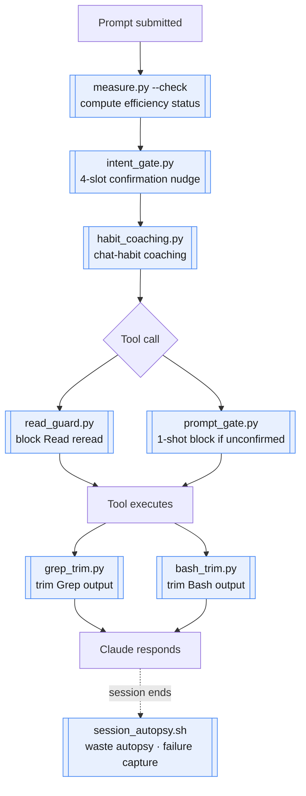

# token-saver

*[한국어](README.md)*

A token-efficiency plugin for Claude Code. The goal isn't minimizing tokens — it's
**maximizing output per token**. Full philosophy in [CLAUDE.md](CLAUDE.md), numeric
evidence in [experiments/PROTOCOL.md](experiments/PROTOCOL.md).

Just chat normally. Claude understands what you're asking and gets on with it — and
when it delegates to a subagent, a gate forces it to pick a model tier (Haiku/Sonnet/
Opus) that fits the task's nature (whether a cheap verifier exists, batch size, risk
level) instead of you having to specify one every time. (This isn't auto-switching —
it's "can't skip the judgment call" enforcement, not full automation; see
[What it does](#what-it-does).) The point isn't cutting cost alone — it's **raising the
quality of what you get for that cost**. Experiments have measured cases where cost
dropped 6.8–7.6× with zero loss in correctness or quality ([Status](#status), evidence
in PROTOCOL.md).


-yellow)


> **Status: v0.3.15, early stage** — calibrated on N=6–7 measured sessions, no
> third-party validation, no vendor claims — only measured facts get recorded. See
> [Status](#status) for detail.

## Requirements

Python 3 (standard library only — no `pip install` needed), Claude Code (a
plugin-capable version).

## Table of Contents

- [Requirements](#requirements)
- [See what changes before installing](#see-what-changes-before-installing)
- [Status](#status)
- [What it does](#what-it-does)
- [Install](#install)
- [Known limitations](#known-limitations)

## See what changes before installing

| Visible on screen | Not visible on screen |
|---|---|
| **4-slot intake gate** — blocks the first tool call of a vague request once and asks for clarification | Reread blocker · output trimmers — run silently |
| | Waste-habit coaching · intent-confirmation nudges · efficiency warnings — attempted via `systemMessage`, but measured to never actually render on screen (see [Known limitations](#known-limitations)); currently reaches only the assistant's own context |

Below is the 4-slot gate's actual behavior, verbatim.

```
User: beef it up more

Claude: (tries to call a tool — prompt_gate.py blocks the first call and responds —
  Markdown 4-slot bullet format, applied 2026-08-11 on Experiment 21's N=20 result)
  Before proceeding, please cover 4 things and retry.
  - **Intent**: what to do
  - **Constraints**: anything to respect
  - **Success criteria**: what "done" looks like
  - **Delegation boundary**: if scope is broad, direct or delegate

Claude: Which part should I strengthen? If you mean the read_guard.py thresholds we
  just touched, tell me which condition to tighten or loosen and I'll go right ahead.
```

The same request, if it's specific about target/constraints/done-criteria from the
start (e.g. "lower LARGE_FILE_LINES in read_guard.py from 500 to 300"), sails through
with zero intervention — this hook only checks **how specific the request is**, never
whether it's right or wrong. It trips at most once per turn per session (exactly one
trip even when a turn fires several tool calls in parallel — concurrency proof in
`tests/test_prompt_gate.py`), and an immediate retry is always allowed.

## Status

Currently v0.3.15, early stage.

- Values are calibrated on **N=6–7 sessions**. No third-party validation (self-measured
  only).
- The `many_agents` threshold is set excluding one outlier session, so it's especially
  unstable.
- No vendor claims — only measured facts get recorded. We don't put out unsupported
  savings figures (e.g. "60–95% savings"). See the market-comparison section in
  [PROTOCOL.md](experiments/PROTOCOL.md) for why (includes a summary of JetBrains'
  independent re-measurement of Ponytail/RTK/Caveman and other external tools' vendor
  claims).

<details>
<summary>Production failure-capture pipeline — false-positive root-cause fix history</summary>

At the point `production_failures.jsonl` had accumulated 141 entries, sample labeling
found 18/18 (100%) were false positives (`experiments/PROTOCOL.md`, Experiment 13). Two
root causes — `capture_failures()` mistaking system `<task-notification>` alerts for
user speech (commit `b3cb163`), and `_similar_desc()` misjudging boilerplate re-review
phrasing as similarity (commit `8ddf98f`) — **both fixed (2026-08-09), verified with
regression tests**. That said, the pre-fix 141-entry log itself hasn't been relabeled
(re-verified) yet, so re-confirm reliability against newly accumulated logs before
using that old log for recalibration.

</details>

<details>
<summary>2026-08-09~10 concurrency/corpus audit of 6 deterministic hooks — 6 real bugs found and fixed</summary>

Audited the reread blocker, both trimmers, the config store, and the 4-slot gate
against concurrency and corpus scenarios, finding and fixing 6 real bugs (3 races from
missing atomicity — `prompt_gate.py`/`read_guard.py`/`config_store.py`; 1 paradox where
trimmed output ended up larger than the original — `grep_trim.py`/`bash_trim.py`; 1
short-input coverage gap — `intent_gate.py`; 1 manifest version drift), all pinned with
regression tests. `habit_coaching.py` (the one hook with no dedicated tests) also got
coverage added this round. Full test suite: 157/157 passing. Detailed scenarios and
evidence logs: commits `b191f98`, `10ade10`, `e435599`.

</details>

## What it does

Here's where each piece intervenes as a turn plays out — blue boxes are deterministic
hooks with no LLM call, white boxes are Claude/tool execution itself.



### Always-on deterministic hooks (no LLM calls)

- **Reread blocker** (`read_guard.py`, PreToolUse)
  Blocks re-reading the exact same range again in the same session, re-reading a
  subset of a range already read, or re-reading a large file (500+ lines by default)
  in full with no scope. If the file changed in the meantime (mtime changed), always
  allowed — rereading to confirm an edit is never blocked. The first hook in this repo
  able to actually deny a tool call.
- **Output trimmers** (`grep_trim.py` / `bash_trim.py`, PostToolUse)
  When Grep matches (100+ lines by default) or Bash output (200+ lines by default) get
  excessive, keeps only the head and tail and elides the middle — the total count is
  always stated, so the information-loss signal is never hidden.
- **4-slot intake gate** (`intent_gate.py` + `prompt_gate.py`)
  Injects a confirmation nudge on vague open-ended requests (when intent, constraints,
  success criteria, or delegation boundary are unclear), and for especially ambiguous
  cases — like a very short message with no target specified — blocks that turn's first
  tool call once, forcing Claude to explain before proceeding (a one-shot trip gate).
  Trips exactly once even under parallel tool calls, via an atomic claim.
- **Waste-habit coaching** (`habit_coaching.py`, UserPromptSubmit)
  Detects chat-habit patterns — excessive connectives, retrospective-plus-reconfirm
  combos, direction pivots, long preambles — and injects a one-line comment. Attempted
  to surface via the `systemMessage` field, but measured to never actually render (see
  [Known limitations](#known-limitations)) — currently reaches only the assistant's own
  context.
- **Forced ladder consult** (`ladder_gate.py`, PreToolUse, matcher: `Agent`)
  Enforces that `token_saver_suggest_tier` was called before any subagent delegation —
  if not, blocks that `Agent` call and tells Claude to consult first; once confirmed,
  stays open for the rest of that turn (unlike prompt_gate, not a one-shot trip). Even
  after confirming, if the `model` actually used in the delegation differs from what
  was just recommended, it forces one re-confirmation ("are you sure about this?") —
  retrying passes (not a hard block — there can be legitimate reasons to diverge from
  the recommendation). This comparison only regex-parses a fixed format string I wrote
  myself ("recommendation: haiku(...") — it still never tries to auto-classify the
  user's actual request (avoiding the Experiment 9 trap). **It still doesn't decide
  which tier is correct** — that's not something deterministic code can do; it only
  enforces "the judgment call can't be skipped." The final model choice remains
  Claude's call. Every time an `Agent` call is actually allowed through, the
  recommended tier, actual model, and match status get logged to
  `ladder_gate_events/`, surfacing cumulatively in `--all`/statusLine/session reports
  as "ladder N times (matched recommendation M)" (2026-08-11). **No dollar conversion
  is invented via counterfactual**: "what would it have cost at a different tier" is
  estimating the cost of an alternative that never happened — the same trap RTK fell
  into with fake counterfactuals (see the market-comparison section under
  [Status](#status)). Instead, `ladder_gate_cost_comparison()` (2026-08-11) approximately
  matches event timestamps against `_subagent_records()` (the actor_breakdown source —
  real subagent tokens and cost), and surfaces "actual $ spent when delegation matched
  the recommendation" vs. "actual $ spent when it diverged" in the session report,
  both purely from measured data (events with no matching subagent aren't invented as
  zero — they're counted separately). Since the log has no exact tool_use_id link, the
  match is a timestamp approximation, not a guaranteed 1:1 — evidence and tests in
  `tests/test_measure_refactor.py` (`test_ladder_gate_cost_comparison_*`).
- **Blocks redundant `token_saver_check` calls** (`check_gate.py`, PreToolUse,
  matcher: `token_saver_check`, 2026-08-11)
  In environments where hooks fire normally (CLI/IDE, macOS Desktop), the `⟢`
  efficiency line is already injected into context every turn, so calling
  `token_saver_check` is always redundant. This used to be left to a prompt-level
  instruction ("skip the call if the line is already visible", Skill
  `token-saver:rules`) — but a real transcript showed the model calling it
  redundantly anyway even while hooks were firing normally (Experiment 11). This
  hook moves that judgment from the prompt into code: **the mere fact that this
  PreToolUse hook ran is deterministic proof hooks are alive** in this environment,
  so it denies unconditionally. In environments where hooks genuinely don't fire
  (Windows Desktop Code tab), this hook itself never runs, so the call passes
  through automatically — no separate branch needed, the hook's own existence is
  the signal.
- **DIY config** (`config_store.py` + MCP `token_saver_config_*`)
  Look up and change the thresholds and kill switches of the hooks above without
  redeploying them. The env kill switch (`TOKEN_SAVER_DISABLE_*`) always takes
  priority.

### Measurement · routing

- **Model-tier routing ladder**
  Mechanical tasks get a first Haiku attempt → oracle verification (compile/test) →
  escalate only on failure. Measured: 3.09× cheaper than going straight to Sonnet on
  tasks with an oracle, and the ladder's "escalate on failure" cost is effectively zero
  (0 failures in an N=30 benchmark, failure-rate upper bound ~10% at 95% CI). **This
  doesn't happen automatically** — Claude Code has no hook point to intercept and
  reselect the model before a main response or subagent spawn, so actually applying the
  ladder is always the assistant's own judgment call when choosing `model` in an
  `Agent` call. The `token_saver_suggest_tier` MCP tool (same call available via
  `measure.py --suggest-tier`) takes oracle presence, batch size, semantic risk, and
  stakes, and deterministically returns a recommendation, rationale, and escalation
  path per this rule — it does **not** judge "how complex is this task" on your behalf
  (prose grading has measured both false positives and false negatives, Experiment 9).
  "So what stops the judgment call from just being skipped?" is closed by
  `ladder_gate.py` (see [Always-on deterministic hooks](#always-on-deterministic-hooks-no-llm-calls)
  above), which forces this tool call before any subagent delegation — the tier
  judgment itself still can't be automated, but skipping the judgment can be made
  impossible.
- **Per-turn efficiency status injection**
  On every prompt submission (`--check`), computes cumulative tokens, cache-hit rate,
  cost, and efficiency score into one line injected into Claude's own context — context
  bloat and cache-hit degradation get a warning appended to the same line, and the
  reread-blocker/trimmer savings estimate and 4-slot gate intervention count roll up
  into the same line/report. The whole line is context-only for Claude — it attempted
  to surface via `systemMessage` only when a warning exists, but measured to never
  render (see [Known limitations](#known-limitations)). Manually configuring
  `statusLine` is still the only confirmed way to see a complete line — savings
  estimate included — on screen at all times.
- **Waste-detection autopsy**
  Automatically analyzes read thrashing, context growth, verbosity, cache-hit rate,
  excessive subagent spawning, and delegation overhead at session end (`--autopsy`).
- **Production failure capture**
  Deterministically (no LLM) detects candidates for first-attempt Haiku failure
  (escalation, user correction) and accumulates them in a log for future recalibration.
  Both root causes behind the 18/18 false positives found in the 141-entry sample are
  fixed (Experiment 13, see [Status](#status)) — reliability to be reconfirmed as new
  logs accumulate. User-correction matching was also narrowed (2026-08-11) to "before
  the next Haiku delegation starts," preventing a single real correction message that
  follows several sequential Haiku attempts from double-matching all of them (this
  still can't catch two Haiku tasks spawned concurrently that overlap — no observed
  case yet). The same class of bug existed in `escalation_pair` (found and fixed
  2026-08-11) — two unrelated Haiku attempts with coincidentally similar descriptions,
  followed by one real escalation, would both get matched to it instead of just the
  nearer one. This path had zero test coverage until then (found via a reproduction
  test).

## Install

```
/plugin marketplace add kimheetae0104/token-saver
/plugin install token-saver@token-saver-tools
```

## Known limitations

### `systemMessage` doesn't render on the user's screen

**Verified (2026-08-10) — negative.** The `systemMessage` field on the
`UserPromptSubmit` hook does not render on the user's screen. This is presumed not a
code defect but a per-event exception in the official docs — the JSON conversions in
`intent_gate.py`, `habit_coaching.py`, and `measure.py --check` are kept as-is (still
valid as a context-injection path, no side effects). [`statusLine`](#statusline-doesnt-show-up-from-installing-the-plugin-alone)
remains the only **confirmed** user-visible path.

<details>
<summary>How it was verified (without repeating the deployment-gap trap)</summary>

The two earlier "verifications" were invalidated by a deployment gap (the installed
plugin was on a stale version), but this time that trap was ruled out first — confirmed
via `ps` that the claude process owning this session started (17:29:02 KST) after the
plugin cache refreshed (0.3.6, 16:58:25 KST), and that the child MCP server was
actually running `token-saver/0.3.6/mcp/server.py`, before asking the user to send a
"test" prompt → the hook definitely fired (confirmed injection of the `⟢` line into the
assistant's context, two turns running), but the user confirmed nothing appeared on
screen either turn.

The cause appears to be an exception clause in `code.claude.com/docs/en/hooks` — the
docs describe `systemMessage` generally as "common to all hook events, shown to the
user," but immediately after, call out `UserPromptSubmit` (plus `UserPromptExpansion`
and `SessionStart`) as an exception where "stdout is added to the context Claude sees"
instead. The docs don't explicitly say this exception also covers the `systemMessage`
field, but this measurement — failing on exactly one of those three events — lines up
precisely with that reading.

Whether "the assistant reminding itself of its own state" actually changes its real
behavior is a separate, still-unmeasured assumption — future work.

</details>

### `statusLine` doesn't show up from installing the plugin alone

`statusLine` (the measure.py-based token/cost status bar) isn't a field Claude Code
lets plugins register (only one statusLine per session, so a plugin can't claim it), so
it won't appear from install alone. The hooks (`UserPromptSubmit`, `Stop`) work
normally right after install — this doesn't mean "installation is broken." To use it,
add it directly to your project (or `~/.claude/settings.json`) after installing:

```json
{
  "statusLine": {
    "type": "command",
    "command": "python3 \"$HOME/.claude/plugins/marketplaces/token-saver-tools/measure.py\" --statusline"
  }
}
```

(This is the actual path when installed exactly per the [Install](#install) steps
above — `marketplace add` clones to
`~/.claude/plugins/marketplaces/<marketplace-name>/`.)

### Claude Desktop app's Code tab — hooks don't fire, Windows-only

**macOS works fine (corrected 2026-08-06 after measurement).**
[desktop/desktop#22138](https://github.com/desktop/desktop/issues/22138) specified the
repro environment as "Windows 11," but this project initially over-generalized it to
all of Desktop. For environments where hooks are actually blocked (Windows Desktop Code
tab, the original issue's repro environment), two best-effort fallbacks remain in
place:

1. The text-coaching rules were ported to the global Skill `token-saver:rules`, which
   applies in every environment without needing MCP.
2. The per-turn efficiency line, session autopsy, and failure capture — which need
   actual transcript computation — are exposed via the MCP server (`mcp/server.py`,
   the `token_saver_check`/`token_saver_autopsy` tools).

<details>
<summary>Correction history + the flaw and its fix (2026-08-11)</summary>

Opening a real macOS Desktop Code-tab session's actual transcript showed the
`UserPromptSubmit` hook firing normally, printing the `⟢` efficiency line as expected
(`experiments/PROTOCOL.md`, Experiment 11).

**Past flaw**: the Skill's self-detection instruction — "skip the MCP call if the
hooks line is already visible" — has been measured to not always hold up in practice
(the model attempting a redundant MCP call even while hooks are firing normally, which
even failed inside Desktop's auto-mode safety check).

**Fix (2026-08-11)**: this judgment moved from the prompt into code — the new
`hooks/check_gate.py` (PreToolUse, matcher: `token_saver_check`) denies the redundant
call deterministically in environments where hooks fire normally, using the fact that
this hook itself ran as proof hooks are alive. In environments where hooks genuinely
don't fire (Windows Desktop Code tab), this hook never runs either, so the call passes
through automatically — no separate branch needed.

Full design: `docs/superpowers/specs/2026-08-05-desktop-active-measurement-design.md`.
Measured results: `experiments/PROTOCOL.md`, Experiment 11.

</details>

## License

[MIT](LICENSE)
