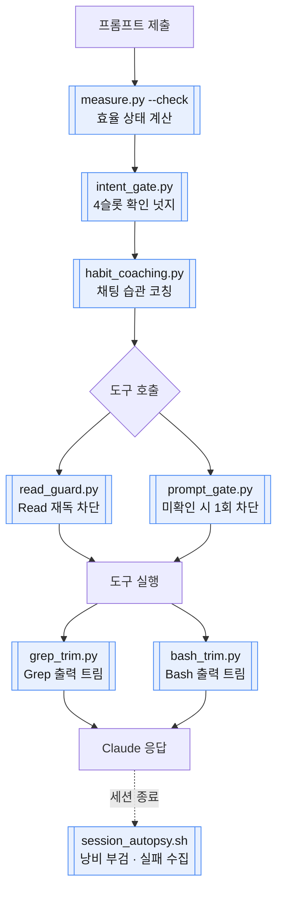

# token-saver

*[English](README.en.md)*

Claude Code용 토큰 효율화 플러그인. 목표는 토큰 최소화가 아니라 **토큰당 아웃풋 극대화** —
자세한 철학은 [CLAUDE.md](CLAUDE.md), 수치 근거는 [experiments/PROTOCOL.md](experiments/PROTOCOL.md) 참고.

평소처럼 편하게 대화하면 됩니다 — Claude가 요청을 이해해서 알아서 작업을 진행하고,
서브에이전트로 위임할 땐 작업 성격(오라클 유무·배치 크기·위험도)에 맞는 모델 티어
(Haiku/Sonnet/Opus)를 사용자가 매번 지정하지 않아도 판단하도록 게이트가 강제합니다
(자동 전환이 아니라 "판단을 빼먹지 못하게" 강제 — 완전 자동화라고 과장하지 않습니다,
[무엇을 하는가](#무엇을-하는가) 참고). 지향점은 비용만 깎는 게 아니라 **같은 비용에
나오는 결과물의 품질까지 같이 끌어올리는 것** — 실험에서 정답률·품질 손실 없이 비용만
6.8~7.6배 줄어든 사례가 실측됐습니다([상태](#상태), 근거는 PROTOCOL.md).


-yellow)


> **상태: v0.3.15, 초기 단계** — N=6~7 세션 실측 기반, 제3자 검증 없음, 벤더 주장 없이
> 실측만 기록합니다. 자세한 내용은 [상태](#상태) 섹션 참고.

## 요구사항

Python 3(표준 라이브러리만 사용 — 별도 `pip install` 불필요), Claude Code(플러그인 지원 버전).

## 목차

- [요구사항](#요구사항)
- [설치 전에 뭐가 달라지는지 보기](#설치-전에-뭐가-달라지는지-보기)
- [상태](#상태)
- [무엇을 하는가](#무엇을-하는가)
- [설치](#설치)
- [알려진 제한사항](#알려진-제한사항)

## 설치 전에 뭐가 달라지는지 보기

| 화면에 보이는 것 | 화면에 안 보이는 것 |
|---|---|
| **4슬롯 착수 게이트** — 모호한 요청의 첫 도구 호출을 1회 막고 확인을 요구 | 재독 차단·출력 트리머 — 무음으로 동작 |
| | 낭비 습관 코칭·의도 확인 넛지·효율 경고 — `systemMessage`로 노출을 시도했지만 실측상 화면에 뜨지 않음([알려진 제한사항](#알려진-제한사항) 참고), 현재는 어시스턴트 자신의 컨텍스트에만 도달 |

아래는 4슬롯 게이트의 실제 동작 그대로의 예시입니다.

```
사용자: 더 강화시켜

Claude: (도구를 호출하려 하면 prompt_gate.py가 첫 호출을 막고 이렇게 응답합니다 —
  Markdown 4슬롯 불릿 포맷, 실험21/N=20 확정 근거로 2026-08-11 적용)
  진행하기 전에 4가지를 먼저 짚고 다시 시도해주세요.
  - **Intent**: 무엇을 할지
  - **Constraints**: 지켜야 할 제약이 있는지
  - **Success criteria**: 뭐가 되면 끝인지
  - **Delegation boundary**: 범위가 넓다면 직접 할지 위임할지

Claude: 어떤 부분을 더 강화할지 짚어주시겠어요? 방금 다룬 read_guard.py의 임계값을
  말씀하시는 거라면, 어떤 조건을 더 엄격하게/느슨하게 할지 알려주시면 바로 진행하겠습니다.
```

같은 요청도 처음부터 대상·제약·완료 기준이 분명하면(예: "read_guard.py의
LARGE_FILE_LINES를 500에서 300으로 낮춰줘") 전혀 개입하지 않고 그대로 진행됩니다 — 이
훅은 **얼마나 구체적인지**만 보지, 요청의 옳고 그름을 판단하지 않습니다. 트립은 세션당
매 턴 최대 1회(같은 턴에서 도구 호출을 병렬로 여러 개 내도 정확히 1번만 개입 — 동시성
검증 근거는 `tests/test_prompt_gate.py`), 재시도는 즉시 허용됩니다.

## 상태

현재 v0.3.15, 초기 단계입니다.

- **N=6~7 세션**으로 보정한 값입니다. 제3자 검증 없음(자체 측정만).
- `many_agents` 임계값은 outlier 세션 1건을 제외하고 정한 값이라 특히 불안정합니다.
- 벤더 주장 없이 실측만 기록합니다 — 근거 없는 절감률(예: "60~95% 절감")을 내세우지
  않습니다. 이유는 [PROTOCOL.md](experiments/PROTOCOL.md)의 시장 비교 섹션 참고
  (Ponytail·RTK·Caveman 등 외부 도구의 벤더 주장 대비 JetBrains 독립 재측정 결과 요약 포함).

<details>
<summary>실사용 실패 수집 파이프라인 — 위양성 근본원인 수정 이력</summary>

`production_failures.jsonl`이 141건을 축적했던 시점에 표본 라벨링 결과 18/18(100%)이
위양성으로 확인됐습니다(`experiments/PROTOCOL.md` 실험13). 근본원인 2건 —
`capture_failures()`가 시스템 `<task-notification>` 알림을 사용자 발화로 오인(커밋
`b3cb163`), `_similar_desc()`가 재검토 정형 문구를 유사도로 오판(커밋 `8ddf98f`) — **둘
다 수정 완료(2026-08-09), 회귀테스트로 검증**. 단, 수정 전 축적된 기존 141건 로그 자체의
재라벨링(재검증)은 아직 하지 않았으므로 그 로그를 그대로 재보정에 쓰기 전엔 새로 축적되는
로그로 신뢰도를 다시 확인할 것.

</details>

<details>
<summary>2026-08-09~10 결정론 훅 6개 동시성·코퍼스 검증 — 실버그 6건 발견·수정</summary>

재독 차단·트리머 2종·설정 저장소·4슬롯 게이트를 동시성·코퍼스 시나리오로 검증해 실버그
6건(원자성 부재로 인한 레이스 3건 — `prompt_gate.py`·`read_guard.py`·`config_store.py`,
트림 결과가 원본보다 커지는 역설 1건 — `grep_trim.py`/`bash_trim.py`, 초단문 커버리지 갭
1건 — `intent_gate.py`, 매니페스트 버전 드리프트 1건)을 발견·수정, 회귀 테스트로
고정했습니다. `habit_coaching.py`(유일하게 전용 테스트가 없던 훅)도 이번에 커버리지
추가. 전체 테스트 스위트 157/157 통과. 상세 시나리오·근거 로그는 커밋 `b191f98`·
`10ade10`·`e435599` 참고.

</details>

## 무엇을 하는가

한 턴이 흘러가는 동안 어느 지점에서 무엇이 개입하는지는 다음과 같습니다 — 파란 상자는
LLM 호출 없는 결정론 훅, 흰 상자는 Claude/도구 실행 자체입니다.



### 항상 켜져 있는 결정론 훅 (LLM 호출 없음)

- **재독 차단** (`read_guard.py`, PreToolUse)
  같은 세션에서 정확히 같은 범위를 다시 Read하거나, 이미 읽은 더 넓은 범위의 부분집합을
  재독하거나, 이미 본 대형 파일(기본 500줄↑)을 스코프 없이 통째로 다시 읽으면 차단.
  파일이 그 사이 바뀌었으면(mtime 변경) 항상 허용 — 수정 확인 재독은 안 막음. 이 repo
  최초로 실제 도구 호출을 deny할 수 있는 훅.
- **출력 트리머** (`grep_trim.py` / `bash_trim.py`, PostToolUse)
  Grep 매치(기본 100줄↑)·Bash 출력(기본 200줄↑)이 과도하면 상위+하위만 남기고 중간을
  생략 — 전체 건수는 항상 명시해 정보 손실 신호를 숨기지 않음.
- **4슬롯 착수 게이트** (`intent_gate.py` + `prompt_gate.py`)
  모호한 착수형 요청(의도·제약·성공기준·위임경계 중 불명확한 게 있으면)에 확인 넛지를
  주입하고, 초단문+대상 생략 조합처럼 특히 애매한 경우엔 그 턴의 첫 도구 호출을 1회만
  막아 Claude가 먼저 설명하고 나서 진행하게 강제(1회성 트립 게이트). 병렬 도구 호출
  아래에서도 원자적 클레임으로 정확히 1회만 트립.
- **낭비 습관 코칭** (`habit_coaching.py`, UserPromptSubmit)
  연결어 과다·과거 회고+재확인 결합·방향전환·긴 배경설명 같은 채팅 습관 패턴을 감지해
  한 줄 피드백. `systemMessage` 필드로 사용자 화면 노출을 시도했으나 뜨지 않는 것으로
  실측 확인됨([알려진 제한사항](#알려진-제한사항) 참고) — 현재는 어시스턴트 컨텍스트에만 도달.
- **사다리 컨설트 강제** (`ladder_gate.py`, PreToolUse matcher: `Agent`)
  서브에이전트 위임 전에 `token_saver_suggest_tier`를 먼저 호출했는지 강제한다 —
  안 했으면 그 Agent 호출을 막고 먼저 호출하라고 안내, 한 번 확인되면 그 턴 내내
  계속 허용(prompt_gate와 달리 1회성 트립이 아님). 확인 후에도 실제 위임에 쓴
  `model`이 방금 추천과 다르면 1회만 "정말 이걸로 할 거냐"고 재확인시킨다(재시도하면
  통과 — 강제 차단 아님, 정당한 이유로 추천과 다르게 고를 수도 있어서). 이 비교는
  제가 직접 만든 고정 포맷 문자열("추천: haiku(...")을 정규식으로 읽는 것뿐 — 사용자
  요청을 자동으로 분류하려는 시도는 여전히 안 함(실험9 함정 회피). **어떤 티어가
  맞는지 자체는 여전히 안 정해준다** — 그건 결정론 코드가 할 수 없는 부분이라,
  "판단을 빼먹지 못하게" 강제만 한다. 최종 모델 선택은 여전히 Claude의 판단.
  Agent 호출이 실제로 통과될 때마다 추천 티어·실제 model·일치 여부를
  `ladder_gate_events/`에 기록해 `--all`/statusLine/세션 리포트에 "사다리 N회(추천대로
  M)"로 누적 노출한다(2026-08-11). **$환산은 counterfactual로 지어내지 않는다**: "다른
  티어로 돌렸으면 얼마였을까"는 실제로 일어나지 않은 대안의 비용 추정이라 RTK류 허수
  counterfactual 함정([상태](#상태) 시장 비교 참고)과 같다 — 대신
  `ladder_gate_cost_comparison()`(2026-08-11)이 이벤트 타임스탬프를
  `_subagent_records()`(actor_breakdown 소스, 서브에이전트 실측 토큰·비용)와 근사 매칭해
  "추천대로 위임했을 때 실제로 쓴 $" vs "추천과 다르게 위임했을 때 실제로 쓴 $"를 둘 다
  실측치로만 세션 리포트에 노출한다(대응 못한 이벤트는 0으로 지어내지 않고 별도 건수로
  표시). tool_use_id 정확 연결이 로그에 없어 타임스탬프 근사 매칭이라 완벽한 1:1은
  아님 — 근거·테스트는 `tests/test_measure_refactor.py`(`test_ladder_gate_cost_comparison_*`).
- **`token_saver_check` 중복 호출 차단** (`check_gate.py`, PreToolUse matcher:
  `token_saver_check`, 2026-08-11)
  hooks가 정상 발화하는 환경(CLI/IDE·macOS Desktop)에서는 `⟢` 효율 줄이 매 턴 이미
  컨텍스트에 들어가 있어 `token_saver_check` MCP 툴 호출이 항상 중복이다 — 예전엔 이
  판단을 "줄이 보이면 호출하지 마라"는 프롬프트 지시(Skill `token-saver:rules`)에만
  맡겼는데, hooks 정상 발화 중에도 모델이 중복 호출을 시도하는 사례가 실측됐다(실험11).
  이 훅은 그 판단을 코드로 옮긴다 — **이 PreToolUse 훅 자체가 실행됐다는 사실이 hooks가
  살아있다는 결정론적 증거**이므로 무조건 deny한다. hooks가 진짜 없는 환경(Windows
  Desktop Code 탭)에서는 이 훅도 당연히 안 뜨므로 자동으로 통과 — 별도 분기 없이 존재
  자체가 판정 기준.
- **DIY 설정** (`config_store.py` + MCP `token_saver_config_*`)
  위 훅들의 임계값·kill switch를 훅 재배포 없이 조회·변경. env kill switch
  (`TOKEN_SAVER_DISABLE_*`)가 항상 최우선.

### 측정 · 라우팅

- **모델 티어 라우팅 사다리**
  기계적 작업은 Haiku 1차 시도 → 오라클(compile/test) 검증 → 실패 시만 상향. 실측:
  오라클 있는 과제에서 Sonnet 직행 대비 3.09배 저렴, 사다리의 "실패 시 상향" 비용은 0
  (N=30 벤치마크에서 실패 0건, 실패율 상한 95% CI ~10%). **자동으로 일어나지는
  않는다** — Claude Code에는 메인 응답이나 서브에이전트 스폰 전에 끼어들어 모델을
  재선택해주는 개입 지점이 없어서, 사다리를 실제로 적용하는 건 언제나 어시스턴트가
  `Agent` 도구 호출에서 `model`을 직접 고르는 판단이다. `token_saver_suggest_tier`
  MCP 툴(`measure.py --suggest-tier`로도 동일 호출)이 오라클 유무·배치 크기·의미론적
  위험·고위험 여부를 받아 이 규칙을 결정론적으로 적용한 추천·근거·에스컬레이션 경로를
  돌려준다 — "이 작업이 복잡한지" 자체를 대신 판단해주진 않는다(프로즈 채점은 위양성·
  위음성이 실측됨, 실험9). "그럼 판단만 하고 실제로 안 지키면 어떡하냐"는 문제는
  `ladder_gate.py`(위 [항상 켜져 있는 결정론 훅](#항상-켜져-있는-결정론-훅-llm-호출-없음))
  가 서브에이전트 위임 전에 이 툴 호출을 강제해 메꾼다 — 티어 판단 자체는 여전히
  자동화 못 하지만, 판단을 빼먹는 건 못 하게 만든다.
- **매 턴 효율 상태 주입**
  프롬프트 제출마다(`--check`) 누적 토큰·캐시 적중률·비용·효율 점수를 한 줄로 계산해
  Claude 자신의 컨텍스트에 주입 — 컨텍스트 비대·캐시 적중 저하는 같은 줄에 경고 추가,
  재독 차단·트리머의 절감 추정치와 4슬롯 게이트 개입 횟수도 같은 줄/리포트에 합산. 전체
  줄은 Claude 컨텍스트 전용입니다 — 경고가 있을 때만 `systemMessage`로 사용자 화면
  노출을 시도했으나 뜨지 않는 것으로 실측 확인됨([알려진 제한사항](#알려진-제한사항)
  참고). `statusLine` 수동 설정이 여전히 절감 추정치까지 포함한 완전한 한 줄을 사용자
  화면에 상시로 보는 유일한 확인된 방법입니다.
- **낭비 탐지 부검**
  read 스래싱, 컨텍스트 성장, 장황함, 캐시 적중률, 서브에이전트 과다호출, 위임
  오버헤드를 세션 종료 시 자동 분석(`--autopsy`).
- **실사용 실패 수집**
  Haiku 1차 실패(에스컬레이션·사용자 교정) 후보를 결정론적으로(LLM 미사용) 감지해
  로그에 누적, 향후 재보정 근거로 사용. 141건 표본에서 발견된 18/18 위양성의 근본원인
  2건은 수정 완료(실험13, [상태](#상태) 참고) — 새로 쌓이는 로그로 신뢰도 재확인 예정.
  사용자 교정 매칭도 "다음 haiku 위임이 시작되기 전까지"로 폭을 좁혀(2026-08-11), haiku
  여러 건이 순차 실행되고 그 뒤에 진짜 교정 메시지가 하나만 왔을 때 모든 haiku 레코드에
  중복 매칭되던 걸 막았다(동시 스폰된 haiku끼리 겹치는 경우는 아직 못 잡음, 실측 사례 없음).
  같은 클래스 버그가 `escalation_pair`에도 있었다(2026-08-11 발견·수정) — 무관한 두
  haiku가 우연히 설명이 비슷하고 그 뒤에 진짜 에스컬레이션 하나만 오면, 그 에스컬레이션이
  가장 가까운 haiku가 아니라 둘 다에 중복 매칭됐음. 이 경로는 그때까지 테스트 커버리지가
  0이었다(재현 테스트로 처음 확인).

## 설치

```
/plugin marketplace add kimheetae0104/token-saver
/plugin install token-saver@token-saver-tools
```

## 알려진 제한사항

### `systemMessage`가 사용자 화면에 안 뜸

**검증 완료(2026-08-10) — 음성.** `UserPromptSubmit` hook의 `systemMessage` 필드는
사용자 화면에 뜨지 않습니다. 코드 결함이 아니라 공식 문서의 이벤트별 예외 조항으로
추정됩니다 — `intent_gate.py`·`habit_coaching.py`·`measure.py --check`의 JSON 전환
자체는 유지합니다(컨텍스트 주입 경로로는 여전히 유효, 부작용 없음). [`statusLine`](#statusline이-플러그인-설치만으로는-안-뜸)이
여전히 유일하게 **확인된** 사용자 가시 경로입니다.

<details>
<summary>어떻게 검증했는지 (배포 갭 재발 없이 확정)</summary>

앞선 두 차례 "검증"은 배포 갭(설치된 플러그인이 구버전) 때문에 무효였으나, 이번엔 그
함정을 미리 배제했습니다 — `ps`로 이 세션을 소유한 claude 프로세스의 기동 시각이
플러그인 캐시 갱신(0.3.6, 16:58:25 KST)보다 늦음(17:29:02 KST)을 먼저 확인하고, 자식
MCP 서버가 실제로 `token-saver/0.3.6/mcp/server.py`를 실행 중임까지 확인한 뒤 사용자에게
"테스트" 프롬프트를 보내달라고 요청 → 훅은 확실히 발화(어시스턴트 컨텍스트에 `⟢` 줄
주입 확인, 2턴 연속)했지만 사용자는 두 턴 모두 화면에 아무것도 안 떴다고 확인.

원인은 `code.claude.com/docs/en/hooks`의 예외 조항으로 보입니다 — 문서는
`systemMessage`를 "전체 hook 이벤트 공통, 사용자에게 표시"라고 일반적으로 서술하면서도,
바로 이어서 `UserPromptSubmit`(과 `UserPromptExpansion`·`SessionStart`)은 예외로
"stdout이 Claude가 보는 컨텍스트로 추가된다"고 별도로 명시합니다. 이 예외 조항이
`systemMessage` 필드에도 적용되는지 문서가 명시하진 않지만, 이번 실측(정확히 이 세
이벤트 중 하나에서만 실패)이 그 해석과 정확히 들어맞습니다.

"어시스턴트 자신의 상태 상기만으로 실제 행동이 달라지는가"도 별개로 아직 실측되지 않은
미검증 가정입니다 — 후속 과제.

</details>

### `statusLine`이 플러그인 설치만으로는 안 뜸

`statusLine`(measure.py 기반 토큰/비용 표시줄)은 Claude Code가 플러그인에 허용하는
필드가 아니라서(세션당 statusLine은 하나뿐이라 플러그인이 등록할 수 없음) 설치만으로는
뜨지 않습니다. 훅(`UserPromptSubmit`·`Stop`)은 설치 즉시 정상 동작하니 "설치가 안
된다"는 뜻이 아닙니다. 쓰려면 설치 후 프로젝트(또는 `~/.claude/settings.json`)에 직접
추가하세요:

```json
{
  "statusLine": {
    "type": "command",
    "command": "python3 \"$HOME/.claude/plugins/marketplaces/token-saver-tools/measure.py\" --statusline"
  }
}
```

(위 명령 그대로 위 [설치](#설치) 절 순서로 설치한 경우의 실제 경로입니다 — marketplace
add 시 클론되는 위치는 `~/.claude/plugins/marketplaces/<marketplace-name>/`.)

### Claude Desktop 앱 Code 탭 — Windows 한정 hooks 미발화

**macOS는 정상 동작합니다(2026-08-06 실측 정정).**
[desktop/desktop#22138](https://github.com/desktop/desktop/issues/22138)이 재현 환경을
"Windows 11"로 명시했는데, 이 프로젝트가 처음엔 이를 Desktop 전체 문제로
과일반화했습니다. Windows Desktop Code 탭(원 이슈 재현 환경) 등 hooks가 실제로 막힌
환경을 위해 두 갈래 best-effort 복원을 남겨둡니다:

1. 텍스트 코칭 규칙은 전역 Skill `token-saver:rules`로 이식돼 MCP 없이도 모든 환경에
   적용됩니다.
2. 실제 트랜스크립트 계산이 필요한 매 턴 효율 줄·세션 부검·실패 사례 수집은 MCP 서버
   (`mcp/server.py`, `token_saver_check`/`token_saver_autopsy` 툴)로 노출됩니다.

<details>
<summary>정정 경위 + 결함과 수정(2026-08-11)</summary>

실사용 macOS Desktop Code 탭 세션의 실제 트랜스크립트를 열어보니 `UserPromptSubmit`
hook이 정상 발화해 `⟢` 효율 줄이 그대로 출력됐습니다(`experiments/PROTOCOL.md` 실험11).

**과거 결함**: Skill의 "hooks 줄이 이미 보이면 MCP 호출 생략" 자기감지 지시가 실전에서
안 지켜지는 사례가 실측됨(hooks 정상 발화 중에도 모델이 MCP를 중복 호출 시도, Desktop
auto-mode 안전성 체크 단계에서 실패까지 함).

**수정(2026-08-11)**: 이 판단을 프롬프트에서 코드로 옮겼습니다 — 새 `hooks/check_gate.py`
(PreToolUse, matcher: `token_saver_check`)가 hooks 정상 발화 환경에서 이 훅 자체가
실행됐다는 사실을 근거로 `token_saver_check` 중복 호출을 결정론적으로 deny합니다.
hooks가 진짜 없는 환경(Windows Desktop Code 탭)에서는 이 훅도 당연히 안 뜨므로
자동으로 통과됩니다 — 별도 분기 없이 존재 자체가 판정 기준.

상세 설계: `docs/superpowers/specs/2026-08-05-desktop-active-measurement-design.md`,
실측 결과: `experiments/PROTOCOL.md` 실험11.

</details>

## 라이선스

[MIT](LICENSE)
